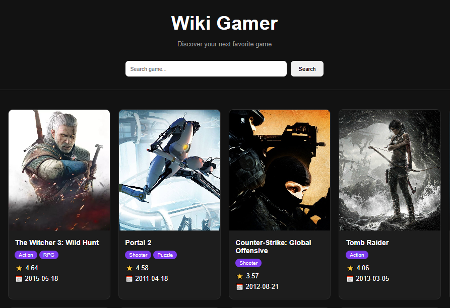

# Wiki Gamer

Aplicação web desenvolvida para pesquisar e explorar informações sobre jogos por meio da API RAWG Video Games Database.

Este projeto aprofunda conceitos de JavaScript por meio do consumo de APIs REST, renderização dinâmica de conteúdo e manipulação do DOM para transformar dados externos em uma interface interativa e responsiva.

## Preview



## Demonstração

Acesse a versão online:

https://phel-lip.github.io/wikiGamer/

## Sobre o Projeto

O Wiki Gamer funciona como um catálogo interativo de jogos, permitindo pesquisar títulos e visualizar informações detalhadas obtidas em tempo real através da API RAWG.

Além da interface, o foco do projeto foi praticar integração com serviços externos, manipulação de dados em JavaScript e atualização dinâmica da página sem recarregamento.

## Funcionalidades

* Busca de jogos por nome
* Exibição de jogos populares
* Cards gerados dinamicamente pela API
* Exibição de gêneros
* Modal com informações detalhadas
* Nota dos usuários e Metacritic
* Data de lançamento
* Tempo médio de gameplay
* Desenvolvedora responsável
* Plataformas disponíveis
* Jogos similares
* Layout responsivo

## Tecnologias Utilizadas

* HTML5
* CSS3
* JavaScript
* REST API (RAWG Video Games Database)

## Estrutura do Projeto

* HTML semântico
* Layout responsivo utilizando CSS
* Consumo de API com Fetch API
* Manipulação do DOM
* Renderização dinâmica de conteúdo
* Organização do JavaScript em funções por responsabilidade

## Como Executar Localmente

```bash
git clone https://github.com/Phel-lip/wikiGamer.git
```

Adicione sua chave da API RAWG no arquivo `script.js`:

```javascript
const API_KEY = "SUA_API_KEY";
```

Abra o arquivo `index.html` no navegador.

## Objetivo

Este projeto foi desenvolvido para praticar integração com APIs REST, manipulação de dados em JavaScript e construção de interfaces dinâmicas consumindo dados de serviços externos.

## Autor

Thasso Holanda

GitHub:
https://github.com/Phel-lip
